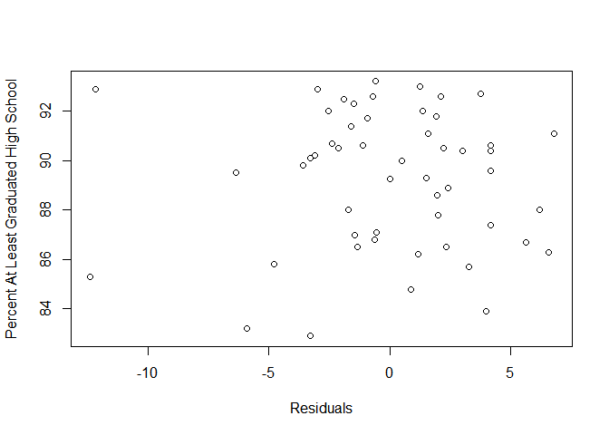

Lung and Bronchus Cancer Regression Analysis
================
12/11/2020

Authors: “Alex Boutilier,Daniel Perry, and Calum Shea”

Abstract:

Lung and bronchus cancer are deadly cancers that target the
cardiovascular system in the human body. In the United States, lung and
bronchus cancer has only a 20.5% 5-year survival rate, it makes up 22.4%
of all cancer deaths, and is the second most common type of cancer. We
perform a regression analysis of lung and bronchus cancer rates
(age-adjusted) in the United States. Our goal here is to find
significant predictors that would increase/decrease lung and bronchus
cancer rates, so we may have a better understanding of where to focus
our resources in fighting this disease.

Source: <https://seer.cancer.gov/statfacts/html/lungb.html>

Introduction:

Regression analysis conducted to determine the most contributing factors
to incidences of Lung and Bronchus cancer in the United States. We look
at a variety of factors from different categories such as education,
diet, smoking, and economic, using 2018 state-level data. Rather than
developing a prediction model we are more so interested in the
relationship between these variables and the incidence rate. If a given
relationship proves to be strong and consistent across states then we
can reasonably conclude that particular variable is a significant factor
that it would be justified in directing policy towards at a country
level given it is immune to changes across states. Reducing the incident
rate of lung and bronchus cancer is desirable because the unprecedented
amount of death, emotional damage, and financial cost that this disease
burdens the US with.

Import master data sheet

All data is categorized by state.

Data Description:

Incidence Data sourced from
<https://statecancerprofiles.cancer.gov/incidencerates/index.php>

Definitions:

Total\_Population: the population by state

Incidence\_Rate: the incidence rate of lung and bronchus cancer
Age-Adjusted cases per 100,000

Lower\_95.\_Confidence\_Interval and Upper\_95.\_Confidence\_Interval:
the CI bounds for the incidence rate of lung and bronchus cancer

Average\_Annual\_Count: the average annual count of lung and bronchus
cancer by state

Recent\_Trend: the incidence rate trend

Recent\_5\_Year.Trend\_in\_Incidence\_Rates: the change in incidence
rate of lung and bronchus cancer in the past 5 years

Screening and Risk Factors Data sourced from
<https://statecancerprofiles.cancer.gov/risk/index.php>

Num\_Respondents: for each risk factor refers to the number of people
responding to the survey

Current\_Percentage\_Smoke: the percentage of people who currently smoke
answering the survey

Percent\_No\_One\_Allowed\_Smoking\_at\_Home: the percentage of people
where smoking is not allowed at home

Percent\_Ever\_Smoked\_100\_Cigarettes: the percentage of people who
have smoked over 100 cigarettes in their life

Percent\_Workers\_in\_NonSmoking\_Environment: the percentage of workers
where smoking is prohibited in their workplace

Percent\_Obese: the percentage of people aged 20+ that have a BMI that
is greater or equal to 30

Percent\_Healthy\_Weight: the percentage of people aged 20+ with a BMI
between 18.5 and 25

Percent\_No\_Physical\_Activity: the percentage of people who engaged in
no leisure-time physical activity

Percent\_Consumed\_More\_Than\_1Fruit\_PerDay: the percentage of people
who consumed more than 1 fruit per day

Percent\_Consumed\_More\_Than\_1Vegetable\_PerDay: the percentage of
people who consumed more than 1 vegetable per day

Demographics sourced from
<https://data.world/uscensusbureau/2014-american-community-survey> and
<https://statecancerprofiles.cancer.gov/demographics/index.php>

Disclaimer: We have converted certain population totals to percentages
because the Incidence\_Rate is per 100,000

All\_Below\_Poverty: total population below the poverty line

M\_Below\_Poverty: total male population below the poverty line

F\_Below\_Poverty: total female population below the poverty line

All\_Above\_Poverty: total population above the poverty line

M\_Above\_Poverty: total male population above the poverty line

F\_Above\_Poverty: total female population above the poverty line

Med\_Income: the median income of the entire population

Med\_Income\_White: the median income of the white population

Med\_Income\_Black: the median income of the black population

Med\_Income\_Nat\_Am: the median income of the national american
population

Med\_Income\_Asian: the median income of the asian population

Med\_Income\_Hispanic: the median income of the hispanic population

M\_With\_HC: male population with health care

M\_Wihtout\_HC: male population without healthcare

F\_With\_HC: female population with health care

F\_Wihtout\_HC: female population without healthcare

All\_With\_HC: total population with healthcare

All\_Without\_HC: total population without healthcare

Percent\_Without\_HC: the percentage of population without healthcare

Percent\_At\_Least\_Grad\_Highschool: the percentage of people that have
at least graduated high school

Percent\_At\_Least\_Bachelors\_Degree: the percentage of people that
have completed at least a bachelors degree.

Unique Data Point:

We added a unique data point (as instructed) labeled “New State”. New
State’s values are simply comprised of the averages of the variables in
the real data. We chose this approach to mitigate the influence that an
artificial data point would have on our analysis, because it is not
representative of real world data, and would therefore not enhance our
understanding of the real world data.

Methods:

In this study, we tested multiple independent variables to see how they
relate to incidence rates of lung and bronchus cancers in the United
States.

Research Data

Our data contains many variables such as smoking, obesity, and fruit and
vegetable consumption that have been divided into further sub-variables
(for example; smoking one hundred cigarettes in their life, allowed
smoking in their house, and more). The data had been found within each
state of the United States of America and certain population totals had
been converted to percentages to avoid miscalculations when it came to
measuring the incidence rate(per 100,000 citizens), so that everything
would be scaled.

Data Analysis

For analyzing the data, we modeled all the data and removed the unwanted
variables from our base model. We then did a Visual Exploratory Analysis
where we investigated groups of predictors for possible correlation
between them. After eliminating variables that were correlated with one
or more others, we created a model with all relevant variables with no
major signs or correlation.

Checking for multicollinearity was our next step. We do this by
analyzing the variance inflation factors (VIFs) of each variable in our
base model and eliminating the one with the largest value. After this,
we repeat the process until all remaining variables have VIFs of less
than seven (7).

After finding this, we had used the stepwise method to work backwards
and find a model where all variables have VIFs above five (5). This gave
us our preferred model.

After finding our new model, we had to validate it. We did this by
observing the coefficients in our model, compared the VIFs from our
original model to the new one, and made sure the predicted responses of
the response variable were not the wrong sign. The data also had to have
its root-mean-square-error (RMSE) evaluated, along with its prediction
accuracy. This was performed by splitting the data in two sets (training
and testing).

The next process was a residual analysis. To do this, we assessed the
normality by making a Q-Q plot, assessed constant variance by plotting
the residuals against fitted values and regressors (two separate plots),
and removed states that were deemed to be outliers from both the Q-Q
plot and residuals against fitted values. When this was done, we then
examined the leverage points and influential observations by plotting
residuals against leverage, and Cook’s Distance versus observation. This
led us to see what the highly influential point(s) were and should be
removed; and thus, our conclusions could be found regarding our main
objective in this analysis.

Results:

Lets have a look at a histogram of the Incidence Rate so we understand
the range/frequency.
<!-- -->

Model Selection:

assigning variables

``` r
response = dataset[,4] #Y variable
predictors = dataset[,10:59]
```

delete unwanted variables from predictors for the base model

``` r
predictors[,c(2,4,6,8,10,12,14,16,18,19,20,21,23,24,25,27,28,29,30,31,32,33,34,35,36,37,40,42,43,44,45,47,48,49)] = NULL
```

Visual Exploratory Analysis:

Checking groups of predictors that are likely to be correlated to each
other

``` r
smokingpredictors = predictors[,c(1,2,3,4)]
ggpairs(smokingpredictors,title = "Pairs Plot All in %")
```

<!-- -->

Current\_Percentage\_Smoke is highly correlated with both
No\_One\_Allowed\_Smoking\_at\_Home and
Ever\_Smoked\_100\_Cigarretes.Therefore lets omit
Current\_Percentage\_Smoke from our predictors.

``` r
predictors[,c(1)]=NULL

healthpredictors = predictors[,c(4,5,6,7,8)]
ggpairs(healthpredictors,title = "Pairs Plot All in %")
```

<!-- -->

Percent\_Obese and Percent\_Healthy\_Weight are highly correlated.

Therefore lets remove Percent\_Healthy\_Weight from the predictors.

``` r
predictors[,c(5)]=NULL

economicpredictors = predictors[,c(8,9,10,11,12,13,14)]

ggpairs(economicpredictors,title = "Pairs Plot All in %")
```

<!-- -->

Percent\_Below\_Poverty is strongly positively correlated with
Med\_Income and At\_Least\_Grad\_Highschool. Unsurprisingly
At\_Least\_Grad\_Bachelors\_Degree is highly correlated with
Med\_Income.

Here is the base model that includes all relevant variables:

``` r
lungmodel = lm(Incidence_Rate ~ Percent_No_One_Allowed_Smoking_at_Home + Percent_Ever_Smoked_100_Cigarettes + Percent_Workers_in_NonSmoking_Environment
               + Percent_Obese + Percent_No_Physical_Activity + Percent_Consumed_More_Than_1Fruit_PerDay + Percent_Consumed_More_Than_1Vegetable_PerDay
               + Percent_Below_Poverty + Med_Income + Percent_without_HC + Percent_At_Least_Grad_Highschool + Percent_At_Least_Bachelors_Degree + Percent_Employed + Percent_born_in_USA, data = dataset)

summary(lungmodel)
```

    ## 
    ## Call:
    ## lm(formula = Incidence_Rate ~ Percent_No_One_Allowed_Smoking_at_Home + 
    ##     Percent_Ever_Smoked_100_Cigarettes + Percent_Workers_in_NonSmoking_Environment + 
    ##     Percent_Obese + Percent_No_Physical_Activity + Percent_Consumed_More_Than_1Fruit_PerDay + 
    ##     Percent_Consumed_More_Than_1Vegetable_PerDay + Percent_Below_Poverty + 
    ##     Med_Income + Percent_without_HC + Percent_At_Least_Grad_Highschool + 
    ##     Percent_At_Least_Bachelors_Degree + Percent_Employed + Percent_born_in_USA, 
    ##     data = dataset)
    ## 
    ## Residuals:
    ##      Min       1Q   Median       3Q      Max 
    ## -11.3397  -1.4914   0.0515   2.4249   6.7495 
    ## 
    ## Coefficients:
    ##                                                Estimate Std. Error t value
    ## (Intercept)                                   2.979e+01  1.009e+02   0.295
    ## Percent_No_One_Allowed_Smoking_at_Home       -6.196e-01  4.142e-01  -1.496
    ## Percent_Ever_Smoked_100_Cigarettes            1.110e+00  4.132e-01   2.687
    ## Percent_Workers_in_NonSmoking_Environment     4.668e-01  1.825e-01   2.557
    ## Percent_Obese                                 1.068e+00  3.847e-01   2.775
    ## Percent_No_Physical_Activity                  1.330e+00  3.450e-01   3.855
    ## Percent_Consumed_More_Than_1Fruit_PerDay      4.611e-01  4.067e-01   1.134
    ## Percent_Consumed_More_Than_1Vegetable_PerDay  9.611e-01  4.860e-01   1.978
    ## Percent_Below_Poverty                        -9.903e-01  7.166e-01  -1.382
    ## Med_Income                                   -1.613e-04  2.431e-04  -0.663
    ## Percent_without_HC                           -2.892e-01  3.725e-01  -0.776
    ## Percent_At_Least_Grad_Highschool             -1.110e+00  6.724e-01  -1.651
    ## Percent_At_Least_Bachelors_Degree             9.084e-02  3.343e-01   0.272
    ## Percent_Employed                             -2.262e-01  8.078e-01  -0.280
    ## Percent_born_in_USA                          -3.552e-01  2.980e-01  -1.192
    ##                                              Pr(>|t|)    
    ## (Intercept)                                  0.769560    
    ## Percent_No_One_Allowed_Smoking_at_Home       0.143177    
    ## Percent_Ever_Smoked_100_Cigarettes           0.010740 *  
    ## Percent_Workers_in_NonSmoking_Environment    0.014782 *  
    ## Percent_Obese                                0.008602 ** 
    ## Percent_No_Physical_Activity                 0.000445 ***
    ## Percent_Consumed_More_Than_1Fruit_PerDay     0.264123    
    ## Percent_Consumed_More_Than_1Vegetable_PerDay 0.055454 .  
    ## Percent_Below_Poverty                        0.175317    
    ## Med_Income                                   0.511165    
    ## Percent_without_HC                           0.442456    
    ## Percent_At_Least_Grad_Highschool             0.107110    
    ## Percent_At_Least_Bachelors_Degree            0.787318    
    ## Percent_Employed                             0.781060    
    ## Percent_born_in_USA                          0.240842    
    ## ---
    ## Signif. codes:  0 '***' 0.001 '**' 0.01 '*' 0.05 '.' 0.1 ' ' 1
    ## 
    ## Residual standard error: 4.544 on 37 degrees of freedom
    ## Multiple R-squared:  0.8851, Adjusted R-squared:  0.8417 
    ## F-statistic: 20.37 on 14 and 37 DF,  p-value: 3.18e-13

After fitting a least squares model with the predictors regressed on
Incidence\_Rate response variable, we have a well-performing model base
model, shown by the Adjusted R^2 of 0.8417.

Checking for Multicollinearity:

Checking the VIF’s allows us to assess the degree to which that
independent variable is orthogonal the others.

``` r
vif(lungmodel)
```

    ##       Percent_No_One_Allowed_Smoking_at_Home 
    ##                                     5.135074 
    ##           Percent_Ever_Smoked_100_Cigarettes 
    ##                                     8.056411 
    ##    Percent_Workers_in_NonSmoking_Environment 
    ##                                     2.327472 
    ##                                Percent_Obese 
    ##                                     5.506598 
    ##                 Percent_No_Physical_Activity 
    ##                                     4.296286 
    ##     Percent_Consumed_More_Than_1Fruit_PerDay 
    ##                                     7.524650 
    ## Percent_Consumed_More_Than_1Vegetable_PerDay 
    ##                                     3.553156 
    ##                        Percent_Below_Poverty 
    ##                                    11.835358 
    ##                                   Med_Income 
    ##                                    11.998201 
    ##                           Percent_without_HC 
    ##                                     4.430785 
    ##             Percent_At_Least_Grad_Highschool 
    ##                                     8.623360 
    ##            Percent_At_Least_Bachelors_Degree 
    ##                                    10.849784 
    ##                             Percent_Employed 
    ##                                     5.946882 
    ##                          Percent_born_in_USA 
    ##                                     9.433523

Med\_Income has the largest VIF of 11.998, lets remove it

    ## 
    ## Call:
    ## lm(formula = Incidence_Rate ~ Percent_No_One_Allowed_Smoking_at_Home + 
    ##     Percent_Ever_Smoked_100_Cigarettes + Percent_Workers_in_NonSmoking_Environment + 
    ##     Percent_Obese + Percent_No_Physical_Activity + Percent_Consumed_More_Than_1Fruit_PerDay + 
    ##     Percent_Consumed_More_Than_1Vegetable_PerDay + Percent_Below_Poverty + 
    ##     Percent_without_HC + Percent_At_Least_Grad_Highschool + Percent_At_Least_Bachelors_Degree + 
    ##     Percent_Employed + Percent_born_in_USA, data = dataset)
    ## 
    ## Residuals:
    ##      Min       1Q   Median       3Q      Max 
    ## -11.8864  -1.9072   0.1363   2.6366   6.8247 
    ## 
    ## Coefficients:
    ##                                              Estimate Std. Error t value
    ## (Intercept)                                  -7.14304   83.57580  -0.085
    ## Percent_No_One_Allowed_Smoking_at_Home       -0.58099    0.40706  -1.427
    ## Percent_Ever_Smoked_100_Cigarettes            1.11581    0.41001   2.721
    ## Percent_Workers_in_NonSmoking_Environment     0.45449    0.18025   2.521
    ## Percent_Obese                                 1.11003    0.37655   2.948
    ## Percent_No_Physical_Activity                  1.36077    0.33927   4.011
    ## Percent_Consumed_More_Than_1Fruit_PerDay      0.53811    0.38690   1.391
    ## Percent_Consumed_More_Than_1Vegetable_PerDay  1.03117    0.47084   2.190
    ## Percent_Below_Poverty                        -0.63487    0.47253  -1.344
    ## Percent_without_HC                           -0.31139    0.36823  -0.846
    ## Percent_At_Least_Grad_Highschool             -1.03180    0.65697  -1.571
    ## Percent_At_Least_Bachelors_Degree            -0.03431    0.27393  -0.125
    ## Percent_Employed                             -0.20692    0.80133  -0.258
    ## Percent_born_in_USA                          -0.31988    0.29103  -1.099
    ##                                              Pr(>|t|)    
    ## (Intercept)                                  0.932338    
    ## Percent_No_One_Allowed_Smoking_at_Home       0.161665    
    ## Percent_Ever_Smoked_100_Cigarettes           0.009755 ** 
    ## Percent_Workers_in_NonSmoking_Environment    0.016001 *  
    ## Percent_Obese                                0.005445 ** 
    ## Percent_No_Physical_Activity                 0.000273 ***
    ## Percent_Consumed_More_Than_1Fruit_PerDay     0.172365    
    ## Percent_Consumed_More_Than_1Vegetable_PerDay 0.034728 *  
    ## Percent_Below_Poverty                        0.187059    
    ## Percent_without_HC                           0.403047    
    ## Percent_At_Least_Grad_Highschool             0.124579    
    ## Percent_At_Least_Bachelors_Degree            0.900995    
    ## Percent_Employed                             0.797627    
    ## Percent_born_in_USA                          0.278627    
    ## ---
    ## Signif. codes:  0 '***' 0.001 '**' 0.01 '*' 0.05 '.' 0.1 ' ' 1
    ## 
    ## Residual standard error: 4.51 on 38 degrees of freedom
    ## Multiple R-squared:  0.8838, Adjusted R-squared:  0.844 
    ## F-statistic: 22.23 on 13 and 38 DF,  p-value: 8.074e-14

    ##       Percent_No_One_Allowed_Smoking_at_Home 
    ##                                     5.033862 
    ##           Percent_Ever_Smoked_100_Cigarettes 
    ##                                     8.052913 
    ##    Percent_Workers_in_NonSmoking_Environment 
    ##                                     2.303413 
    ##                                Percent_Obese 
    ##                                     5.354394 
    ##                 Percent_No_Physical_Activity 
    ##                                     4.217987 
    ##     Percent_Consumed_More_Than_1Fruit_PerDay 
    ##                                     6.912235 
    ## Percent_Consumed_More_Than_1Vegetable_PerDay 
    ##                                     3.385217 
    ##                        Percent_Below_Poverty 
    ##                                     5.222556 
    ##                           Percent_without_HC 
    ##                                     4.395017 
    ##             Percent_At_Least_Grad_Highschool 
    ##                                     8.355540 
    ##            Percent_At_Least_Bachelors_Degree 
    ##                                     7.394649 
    ##                             Percent_Employed 
    ##                                     5.939215 
    ##                          Percent_born_in_USA 
    ##                                     9.132085

Percent\_born\_in\_USA has a VIF of 9.132, lets remove it

    ## 
    ## Call:
    ## lm(formula = Incidence_Rate ~ Percent_No_One_Allowed_Smoking_at_Home + 
    ##     Percent_Ever_Smoked_100_Cigarettes + Percent_Workers_in_NonSmoking_Environment + 
    ##     Percent_Obese + Percent_No_Physical_Activity + Percent_Consumed_More_Than_1Fruit_PerDay + 
    ##     Percent_Consumed_More_Than_1Vegetable_PerDay + Percent_Below_Poverty + 
    ##     Percent_without_HC + Percent_At_Least_Grad_Highschool + Percent_At_Least_Bachelors_Degree + 
    ##     Percent_Employed, data = dataset)
    ## 
    ## Residuals:
    ##      Min       1Q   Median       3Q      Max 
    ## -12.2888  -2.0025   0.0458   2.3219   6.7282 
    ## 
    ## Coefficients:
    ##                                              Estimate Std. Error t value
    ## (Intercept)                                    7.6862    82.6993   0.093
    ## Percent_No_One_Allowed_Smoking_at_Home        -0.6713     0.3997  -1.679
    ## Percent_Ever_Smoked_100_Cigarettes             0.9580     0.3851   2.488
    ## Percent_Workers_in_NonSmoking_Environment      0.4118     0.1765   2.333
    ## Percent_Obese                                  0.8728     0.3094   2.821
    ## Percent_No_Physical_Activity                   1.3987     0.3384   4.133
    ## Percent_Consumed_More_Than_1Fruit_PerDay       0.6819     0.3651   1.868
    ## Percent_Consumed_More_Than_1Vegetable_PerDay   0.7428     0.3920   1.895
    ## Percent_Below_Poverty                         -0.8999     0.4075  -2.208
    ## Percent_without_HC                            -0.1699     0.3459  -0.491
    ## Percent_At_Least_Grad_Highschool              -1.3918     0.5710  -2.438
    ## Percent_At_Least_Bachelors_Degree             -0.0107     0.2738  -0.039
    ## Percent_Employed                               0.1623     0.7294   0.223
    ##                                              Pr(>|t|)    
    ## (Intercept)                                  0.926426    
    ## Percent_No_One_Allowed_Smoking_at_Home       0.101075    
    ## Percent_Ever_Smoked_100_Cigarettes           0.017234 *  
    ## Percent_Workers_in_NonSmoking_Environment    0.024881 *  
    ## Percent_Obese                                0.007486 ** 
    ## Percent_No_Physical_Activity                 0.000183 ***
    ## Percent_Consumed_More_Than_1Fruit_PerDay     0.069313 .  
    ## Percent_Consumed_More_Than_1Vegetable_PerDay 0.065541 .  
    ## Percent_Below_Poverty                        0.033157 *  
    ## Percent_without_HC                           0.626027    
    ## Percent_At_Least_Grad_Highschool             0.019449 *  
    ## Percent_At_Least_Bachelors_Degree            0.969016    
    ## Percent_Employed                             0.825043    
    ## ---
    ## Signif. codes:  0 '***' 0.001 '**' 0.01 '*' 0.05 '.' 0.1 ' ' 1
    ## 
    ## Residual standard error: 4.522 on 39 degrees of freedom
    ## Multiple R-squared:  0.8801, Adjusted R-squared:  0.8432 
    ## F-statistic: 23.85 on 12 and 39 DF,  p-value: 2.841e-14

    ##       Percent_No_One_Allowed_Smoking_at_Home 
    ##                                     4.828704 
    ##           Percent_Ever_Smoked_100_Cigarettes 
    ##                                     7.065567 
    ##    Percent_Workers_in_NonSmoking_Environment 
    ##                                     2.196371 
    ##                                Percent_Obese 
    ##                                     3.594703 
    ##                 Percent_No_Physical_Activity 
    ##                                     4.174225 
    ##     Percent_Consumed_More_Than_1Fruit_PerDay 
    ##                                     6.121927 
    ## Percent_Consumed_More_Than_1Vegetable_PerDay 
    ##                                     2.333813 
    ##                        Percent_Below_Poverty 
    ##                                     3.862820 
    ##                           Percent_without_HC 
    ##                                     3.858056 
    ##             Percent_At_Least_Grad_Highschool 
    ##                                     6.278357 
    ##            Percent_At_Least_Bachelors_Degree 
    ##                                     7.349207 
    ##                             Percent_Employed 
    ##                                     4.895258

Percent\_At\_Least\_Bachelors\_Degree has a VIF of 7.349, lets remove it

    ## 
    ## Call:
    ## lm(formula = Incidence_Rate ~ Percent_No_One_Allowed_Smoking_at_Home + 
    ##     Percent_Ever_Smoked_100_Cigarettes + Percent_Workers_in_NonSmoking_Environment + 
    ##     Percent_Obese + Percent_No_Physical_Activity + Percent_Consumed_More_Than_1Fruit_PerDay + 
    ##     Percent_Consumed_More_Than_1Vegetable_PerDay + Percent_Below_Poverty + 
    ##     Percent_without_HC + Percent_At_Least_Grad_Highschool + Percent_Employed, 
    ##     data = dataset)
    ## 
    ## Residuals:
    ##      Min       1Q   Median       3Q      Max 
    ## -12.2955  -2.0220   0.0372   2.3418   6.7478 
    ## 
    ## Coefficients:
    ##                                              Estimate Std. Error t value
    ## (Intercept)                                    8.5223    78.8822   0.108
    ## Percent_No_One_Allowed_Smoking_at_Home        -0.6702     0.3937  -1.702
    ## Percent_Ever_Smoked_100_Cigarettes             0.9685     0.2723   3.557
    ## Percent_Workers_in_NonSmoking_Environment      0.4099     0.1673   2.450
    ## Percent_Obese                                  0.8756     0.2969   2.949
    ## Percent_No_Physical_Activity                   1.3999     0.3329   4.205
    ## Percent_Consumed_More_Than_1Fruit_PerDay       0.6829     0.3596   1.899
    ## Percent_Consumed_More_Than_1Vegetable_PerDay   0.7363     0.3506   2.100
    ## Percent_Below_Poverty                         -0.8982     0.4000  -2.245
    ## Percent_without_HC                            -0.1691     0.3410  -0.496
    ## Percent_At_Least_Grad_Highschool              -1.3913     0.5636  -2.468
    ## Percent_Employed                               0.1461     0.5925   0.247
    ##                                              Pr(>|t|)    
    ## (Intercept)                                  0.914505    
    ## Percent_No_One_Allowed_Smoking_at_Home       0.096435 .  
    ## Percent_Ever_Smoked_100_Cigarettes           0.000984 ***
    ## Percent_Workers_in_NonSmoking_Environment    0.018765 *  
    ## Percent_Obese                                0.005299 ** 
    ## Percent_No_Physical_Activity                 0.000143 ***
    ## Percent_Consumed_More_Than_1Fruit_PerDay     0.064755 .  
    ## Percent_Consumed_More_Than_1Vegetable_PerDay 0.042069 *  
    ## Percent_Below_Poverty                        0.030344 *  
    ## Percent_without_HC                           0.622608    
    ## Percent_At_Least_Grad_Highschool             0.017946 *  
    ## Percent_Employed                             0.806458    
    ## ---
    ## Signif. codes:  0 '***' 0.001 '**' 0.01 '*' 0.05 '.' 0.1 ' ' 1
    ## 
    ## Residual standard error: 4.465 on 40 degrees of freedom
    ## Multiple R-squared:  0.8801, Adjusted R-squared:  0.8471 
    ## F-statistic: 26.68 on 11 and 40 DF,  p-value: 5.325e-15

    ##       Percent_No_One_Allowed_Smoking_at_Home 
    ##                                     4.802599 
    ##           Percent_Ever_Smoked_100_Cigarettes 
    ##                                     3.623850 
    ##    Percent_Workers_in_NonSmoking_Environment 
    ##                                     2.024293 
    ##                                Percent_Obese 
    ##                                     3.395581 
    ##                 Percent_No_Physical_Activity 
    ##                                     4.143836 
    ##     Percent_Consumed_More_Than_1Fruit_PerDay 
    ##                                     6.090599 
    ## Percent_Consumed_More_Than_1Vegetable_PerDay 
    ##                                     1.914609 
    ##                        Percent_Below_Poverty 
    ##                                     3.818230 
    ##                           Percent_without_HC 
    ##                                     3.845067 
    ##             Percent_At_Least_Grad_Highschool 
    ##                                     6.274208 
    ##                             Percent_Employed 
    ##                                     3.312409

The remaining VIF’s are below 7 and we will move forward with finding
the “best” model with stepwise in backwards direction.

    ## Start:  AIC=165.98
    ## Incidence_Rate ~ Percent_No_One_Allowed_Smoking_at_Home + Percent_Ever_Smoked_100_Cigarettes + 
    ##     Percent_Workers_in_NonSmoking_Environment + Percent_Obese + 
    ##     Percent_No_Physical_Activity + Percent_Consumed_More_Than_1Fruit_PerDay + 
    ##     Percent_Consumed_More_Than_1Vegetable_PerDay + Percent_Below_Poverty + 
    ##     Percent_without_HC + Percent_At_Least_Grad_Highschool + Percent_Employed
    ## 
    ##                                                Df Sum of Sq     RSS    AIC
    ## - Percent_Employed                              1      1.21  798.79 164.06
    ## - Percent_without_HC                            1      4.91  802.48 164.30
    ## <none>                                                       797.57 165.98
    ## - Percent_No_One_Allowed_Smoking_at_Home        1     57.79  855.36 167.62
    ## - Percent_Consumed_More_Than_1Fruit_PerDay      1     71.93  869.50 168.47
    ## - Percent_Consumed_More_Than_1Vegetable_PerDay  1     87.94  885.52 169.42
    ## - Percent_Below_Poverty                         1    100.52  898.09 170.15
    ## - Percent_Workers_in_NonSmoking_Environment     1    119.67  917.24 171.25
    ## - Percent_At_Least_Grad_Highschool              1    121.48  919.06 171.35
    ## - Percent_Obese                                 1    173.44  971.01 174.21
    ## - Percent_Ever_Smoked_100_Cigarettes            1    252.22 1049.79 178.26
    ## - Percent_No_Physical_Activity                  1    352.52 1150.09 183.01
    ## 
    ## Step:  AIC=164.06
    ## Incidence_Rate ~ Percent_No_One_Allowed_Smoking_at_Home + Percent_Ever_Smoked_100_Cigarettes + 
    ##     Percent_Workers_in_NonSmoking_Environment + Percent_Obese + 
    ##     Percent_No_Physical_Activity + Percent_Consumed_More_Than_1Fruit_PerDay + 
    ##     Percent_Consumed_More_Than_1Vegetable_PerDay + Percent_Below_Poverty + 
    ##     Percent_without_HC + Percent_At_Least_Grad_Highschool
    ## 
    ##                                                Df Sum of Sq     RSS    AIC
    ## - Percent_without_HC                            1      9.76  808.54 162.69
    ## <none>                                                       798.79 164.06
    ## - Percent_No_One_Allowed_Smoking_at_Home        1     57.58  856.37 165.68
    ## - Percent_Consumed_More_Than_1Fruit_PerDay      1     86.55  885.33 167.41
    ## - Percent_Consumed_More_Than_1Vegetable_PerDay  1     95.98  894.77 167.96
    ## - Percent_Below_Poverty                         1     99.49  898.27 168.16
    ## - Percent_Workers_in_NonSmoking_Environment     1    119.31  918.09 169.29
    ## - Percent_At_Least_Grad_Highschool              1    145.68  944.46 170.77
    ## - Percent_Obese                                 1    185.15  983.94 172.90
    ## - Percent_No_Physical_Activity                  1    365.76 1164.55 181.66
    ## - Percent_Ever_Smoked_100_Cigarettes            1    424.02 1222.80 184.20
    ## 
    ## Step:  AIC=162.69
    ## Incidence_Rate ~ Percent_No_One_Allowed_Smoking_at_Home + Percent_Ever_Smoked_100_Cigarettes + 
    ##     Percent_Workers_in_NonSmoking_Environment + Percent_Obese + 
    ##     Percent_No_Physical_Activity + Percent_Consumed_More_Than_1Fruit_PerDay + 
    ##     Percent_Consumed_More_Than_1Vegetable_PerDay + Percent_Below_Poverty + 
    ##     Percent_At_Least_Grad_Highschool
    ## 
    ##                                                Df Sum of Sq     RSS    AIC
    ## <none>                                                       808.54 162.69
    ## - Percent_Consumed_More_Than_1Vegetable_PerDay  1     95.39  903.93 166.49
    ## - Percent_Below_Poverty                         1    127.03  935.57 168.28
    ## - Percent_No_One_Allowed_Smoking_at_Home        1    129.93  938.47 168.44
    ## - Percent_At_Least_Grad_Highschool              1    140.01  948.55 168.99
    ## - Percent_Consumed_More_Than_1Fruit_PerDay      1    146.60  955.14 169.35
    ## - Percent_Workers_in_NonSmoking_Environment     1    146.90  955.44 169.37
    ## - Percent_Obese                                 1    187.45  995.99 171.53
    ## - Percent_No_Physical_Activity                  1    372.68 1181.23 180.40
    ## - Percent_Ever_Smoked_100_Cigarettes            1    414.37 1222.91 182.20

    ## 
    ## Call:
    ## lm(formula = Incidence_Rate ~ Percent_No_One_Allowed_Smoking_at_Home + 
    ##     Percent_Ever_Smoked_100_Cigarettes + Percent_Workers_in_NonSmoking_Environment + 
    ##     Percent_Obese + Percent_No_Physical_Activity + Percent_Consumed_More_Than_1Fruit_PerDay + 
    ##     Percent_Consumed_More_Than_1Vegetable_PerDay + Percent_Below_Poverty + 
    ##     Percent_At_Least_Grad_Highschool, data = dataset)
    ## 
    ## Residuals:
    ##      Min       1Q   Median       3Q      Max 
    ## -12.3899  -1.9733   0.2417   2.3544   6.7697 
    ## 
    ## Coefficients:
    ##                                              Estimate Std. Error t value
    ## (Intercept)                                   21.3231    61.8881   0.345
    ## Percent_No_One_Allowed_Smoking_at_Home        -0.8258     0.3179  -2.598
    ## Percent_Ever_Smoked_100_Cigarettes             0.9829     0.2119   4.639
    ## Percent_Workers_in_NonSmoking_Environment      0.4390     0.1589   2.762
    ## Percent_Obese                                  0.8557     0.2742   3.120
    ## Percent_No_Physical_Activity                   1.4230     0.3234   4.400
    ## Percent_Consumed_More_Than_1Fruit_PerDay       0.8210     0.2975   2.760
    ## Percent_Consumed_More_Than_1Vegetable_PerDay   0.7512     0.3375   2.226
    ## Percent_Below_Poverty                         -0.9684     0.3770  -2.569
    ## Percent_At_Least_Grad_Highschool              -1.4031     0.5203  -2.697
    ##                                              Pr(>|t|)    
    ## (Intercept)                                   0.73216    
    ## Percent_No_One_Allowed_Smoking_at_Home        0.01288 *  
    ## Percent_Ever_Smoked_100_Cigarettes           3.40e-05 ***
    ## Percent_Workers_in_NonSmoking_Environment     0.00848 ** 
    ## Percent_Obese                                 0.00326 ** 
    ## Percent_No_Physical_Activity                 7.27e-05 ***
    ## Percent_Consumed_More_Than_1Fruit_PerDay      0.00854 ** 
    ## Percent_Consumed_More_Than_1Vegetable_PerDay  0.03144 *  
    ## Percent_Below_Poverty                         0.01385 *  
    ## Percent_At_Least_Grad_Highschool              0.01003 *  
    ## ---
    ## Signif. codes:  0 '***' 0.001 '**' 0.01 '*' 0.05 '.' 0.1 ' ' 1
    ## 
    ## Residual standard error: 4.388 on 42 degrees of freedom
    ## Multiple R-squared:  0.8784, Adjusted R-squared:  0.8524 
    ## F-statistic: 33.72 on 9 and 42 DF,  p-value: < 2.2e-16

    ##       Percent_No_One_Allowed_Smoking_at_Home 
    ##                                     3.243063 
    ##           Percent_Ever_Smoked_100_Cigarettes 
    ##                                     2.271980 
    ##    Percent_Workers_in_NonSmoking_Environment 
    ##                                     1.892101 
    ##                                Percent_Obese 
    ##                                     3.000374 
    ##                 Percent_No_Physical_Activity 
    ##                                     4.050379 
    ##     Percent_Consumed_More_Than_1Fruit_PerDay 
    ##                                     4.318363 
    ## Percent_Consumed_More_Than_1Vegetable_PerDay 
    ##                                     1.837617 
    ##                        Percent_Below_Poverty 
    ##                                     3.512260 
    ##             Percent_At_Least_Grad_Highschool 
    ##                                     5.537389

<!-- -->

Percent\_At\_Least\_Grad\_Highschool has a VIF above 5, lets remove it

    ## 
    ## Call:
    ## lm(formula = Incidence_Rate ~ Percent_No_One_Allowed_Smoking_at_Home + 
    ##     Percent_Ever_Smoked_100_Cigarettes + Percent_Workers_in_NonSmoking_Environment + 
    ##     Percent_Obese + Percent_No_Physical_Activity + Percent_Consumed_More_Than_1Fruit_PerDay + 
    ##     Percent_Consumed_More_Than_1Vegetable_PerDay + Percent_Below_Poverty, 
    ##     data = dataset)
    ## 
    ## Residuals:
    ##      Min       1Q   Median       3Q      Max 
    ## -13.1937  -2.6864   0.1024   3.2030   7.9817 
    ## 
    ## Coefficients:
    ##                                              Estimate Std. Error t value
    ## (Intercept)                                  -82.0680    52.0059  -1.578
    ## Percent_No_One_Allowed_Smoking_at_Home        -0.8300     0.3402  -2.439
    ## Percent_Ever_Smoked_100_Cigarettes             0.7964     0.2144   3.715
    ## Percent_Workers_in_NonSmoking_Environment      0.2845     0.1587   1.793
    ## Percent_Obese                                  0.7515     0.2906   2.586
    ## Percent_No_Physical_Activity                   1.8649     0.2985   6.248
    ## Percent_Consumed_More_Than_1Fruit_PerDay       0.9116     0.3164   2.881
    ## Percent_Consumed_More_Than_1Vegetable_PerDay   0.4599     0.3423   1.344
    ## Percent_Below_Poverty                         -0.3015     0.3046  -0.990
    ##                                              Pr(>|t|)    
    ## (Intercept)                                  0.121883    
    ## Percent_No_One_Allowed_Smoking_at_Home       0.018913 *  
    ## Percent_Ever_Smoked_100_Cigarettes           0.000581 ***
    ## Percent_Workers_in_NonSmoking_Environment    0.080055 .  
    ## Percent_Obese                                0.013184 *  
    ## Percent_No_Physical_Activity                 1.59e-07 ***
    ## Percent_Consumed_More_Than_1Fruit_PerDay     0.006160 ** 
    ## Percent_Consumed_More_Than_1Vegetable_PerDay 0.186068    
    ## Percent_Below_Poverty                        0.327730    
    ## ---
    ## Signif. codes:  0 '***' 0.001 '**' 0.01 '*' 0.05 '.' 0.1 ' ' 1
    ## 
    ## Residual standard error: 4.697 on 43 degrees of freedom
    ## Multiple R-squared:  0.8574, Adjusted R-squared:  0.8308 
    ## F-statistic: 32.31 on 8 and 43 DF,  p-value: 9.104e-16

    ##       Percent_No_One_Allowed_Smoking_at_Home 
    ##                                     3.242984 
    ##           Percent_Ever_Smoked_100_Cigarettes 
    ##                                     2.029827 
    ##    Percent_Workers_in_NonSmoking_Environment 
    ##                                     1.646074 
    ##                                Percent_Obese 
    ##                                     2.940817 
    ##                 Percent_No_Physical_Activity 
    ##                                     3.010800 
    ##     Percent_Consumed_More_Than_1Fruit_PerDay 
    ##                                     4.263224 
    ## Percent_Consumed_More_Than_1Vegetable_PerDay 
    ##                                     1.649354 
    ##                        Percent_Below_Poverty 
    ##                                     2.001175

From the VIF’s they indicate that the model is not likely affected by
multicollinearity, however not all the parameters are statistically
significant All the coefficients logically make sense except
Consumed\_More\_Than\_1Vegetable\_PerDay which may have the wrong sign.

``` r
Xfinal = predictors[,c(1,2,3,4,5,7,8)]
ggpairs(Xfinal,title = "Pairs Plot All in %")
```

<!-- -->

The predictors of the final model do not look linearly dependent. We
must choose to go with either the final model or the selected model. The
“selectedModel” might have minor multicollinearity problems but all the
coefficients are significant. The final model has less multicollinearity
problems but not all the coefficients are statistically significant. We
are moving forward with the selectedModel being our preferred model on
the basis of its significant predictors and higher adjusted r-squared.

Validation of model:

1.  Analysis of the Model Coefficients and Predicted Values

Are coefficients stable? Are signs and magnitudes reasonable?

    ##                                  (Intercept) 
    ##                                   21.3231026 
    ##       Percent_No_One_Allowed_Smoking_at_Home 
    ##                                   -0.8257671 
    ##           Percent_Ever_Smoked_100_Cigarettes 
    ##                                    0.9829396 
    ##    Percent_Workers_in_NonSmoking_Environment 
    ##                                    0.4390185 
    ##                                Percent_Obese 
    ##                                    0.8556702 
    ##                 Percent_No_Physical_Activity 
    ##                                    1.4230416 
    ##     Percent_Consumed_More_Than_1Fruit_PerDay 
    ##                                    0.8209540 
    ## Percent_Consumed_More_Than_1Vegetable_PerDay 
    ##                                    0.7512156 
    ##                        Percent_Below_Poverty 
    ##                                   -0.9683846 
    ##             Percent_At_Least_Grad_Highschool 
    ##                                   -1.4031308

The coefficients Percent\_Ever\_Smoked\_100\_Cigarettes, Percent\_Obese,
Percent\_No\_One\_Allowed\_Smoking\_at\_Home,
Percent\_No\_Physical\_Activity all have signs that seem plausible, as
well as reasonable magnitudes.The Percent\_At\_Least\_Grad\_Highschool
coefficient has a negative magnitude that may be to large.
Percent\_Consumed\_More\_Than\_1Fruit\_PerDay’s coefficient and
Percent\_Consumed\_More\_Than\_1Vegetable\_PerDay’s coefficient are not
reasonable.

Possible explanations of coefficients signs, why we aren’t necessarily
concerned:

Percent at least graduated high school, percent below poverty, and
percent workers in non-smoking environment, yield some coefficients that
may go against our intuition, we did not determine any to be problematic
as there are reasonable arguments to be made that would explain their
effect. Percent at least graduated high school having a negative impact
on the incidence rate is perfectly reasonable as more educated
individuals may have a better understanding of the impact of smoking
among many other explanations. Percent below poverty having a negative
impact on the incident rate may simply be because those with less
disposable income have less money to buy cigarettes with and as a result
fewer of the poor develop lung and bronchus cancer. Working in a
non-smoking environment having a positive effect on the cancer rate may
be the least intuitive but having to abstain from smoking all day
without relief may result in chain smoking outside of work.

2.  Are VIFs or other measures of collinearity raising flags?

Now apply variance inflation factors to assess for multicollinearity. A
large vif indicates that the variable is not linearly independent with
the others. A large vif is typically a value exceeding 10.

``` r
vif(lungmodel)
```

    ##       Percent_No_One_Allowed_Smoking_at_Home 
    ##                                     5.135074 
    ##           Percent_Ever_Smoked_100_Cigarettes 
    ##                                     8.056411 
    ##    Percent_Workers_in_NonSmoking_Environment 
    ##                                     2.327472 
    ##                                Percent_Obese 
    ##                                     5.506598 
    ##                 Percent_No_Physical_Activity 
    ##                                     4.296286 
    ##     Percent_Consumed_More_Than_1Fruit_PerDay 
    ##                                     7.524650 
    ## Percent_Consumed_More_Than_1Vegetable_PerDay 
    ##                                     3.553156 
    ##                        Percent_Below_Poverty 
    ##                                    11.835358 
    ##                                   Med_Income 
    ##                                    11.998201 
    ##                           Percent_without_HC 
    ##                                     4.430785 
    ##             Percent_At_Least_Grad_Highschool 
    ##                                     8.623360 
    ##            Percent_At_Least_Bachelors_Degree 
    ##                                    10.849784 
    ##                             Percent_Employed 
    ##                                     5.946882 
    ##                          Percent_born_in_USA 
    ##                                     9.433523

From our original model we can see that several predictors have larger
vif’s than 10 indicating that some of the predictors may have
multicollinearity problems.

``` r
vif(selectedModel)
```

    ##       Percent_No_One_Allowed_Smoking_at_Home 
    ##                                     3.243063 
    ##           Percent_Ever_Smoked_100_Cigarettes 
    ##                                     2.271980 
    ##    Percent_Workers_in_NonSmoking_Environment 
    ##                                     1.892101 
    ##                                Percent_Obese 
    ##                                     3.000374 
    ##                 Percent_No_Physical_Activity 
    ##                                     4.050379 
    ##     Percent_Consumed_More_Than_1Fruit_PerDay 
    ##                                     4.318363 
    ## Percent_Consumed_More_Than_1Vegetable_PerDay 
    ##                                     1.837617 
    ##                        Percent_Below_Poverty 
    ##                                     3.512260 
    ##             Percent_At_Least_Grad_Highschool 
    ##                                     5.537389

However when we removed the predictors that were not significant via the
stepwise regression method with backward elimination, all the vif’s are
well below 10. Thus multicollinearity seems to be less of a problem with
our new selected model.Our selected model seems to not be affected by
multicollinearity in such a way that would undermine the integrity of
the model and the parameters are all statistically significant.

Are predicted responses y of the wrong sign? Or outside of the range of
those observed?

    ##     1     2     3     4     5     6     7     8     9    10    11    12    13 
    ## 69.68 52.04 47.42 76.05 44.78 43.01 57.37 47.73 70.50 59.42 57.19 43.79 45.33 
    ##    14    15    16    17    18    19    20    21    22    23    24    25    26 
    ## 61.31 70.26 61.93 58.61 87.73 65.33 73.59 55.92 58.19 65.44 54.87 70.93 67.84 
    ##    27    28    29    30    31    32    33    34    35    36    37    38    39 
    ## 54.28 55.63 46.73 66.70 61.65 50.89 56.36 63.53 59.62 71.18 65.40 49.96 66.59 
    ##    40    41    42    43    44    45    46    47    48    49    50    51    52 
    ## 64.10 64.95 59.92 75.97 56.52 28.52 58.98 54.88 47.23 81.13 59.79 54.36 59.62

    ##  [1] 64.90 55.80 46.80 77.20 41.50 41.40 59.60 46.60 66.90 57.70 62.80 45.70
    ## [13] 49.50 63.70 72.20 63.30 56.20 91.00 66.20 72.10 56.40 61.20 63.30 56.10
    ## [25] 74.90 72.00 53.70 57.20 53.30 63.70 55.30 38.50 58.70 67.70 57.70 67.90
    ## [37] 67.40 54.10 63.50 70.30 64.40 59.00 74.50 50.60 26.00 61.10 56.40 54.00
    ## [49] 79.80 59.10 42.20 59.63

The predicted responses of Incidence\_Rate from the selectedModel are
all the correct sign and well within the range of those that were
observed.

We will now split the data into training and testing sets to evaluate
the RMSE and prediction accuracy

``` r
set.seed(1)

ratio=20

for(i in 1:5){
  
  train = sample(c(1:length(dataset$Incidence_Rate)),ratio)
  traindat = dataset[train, ]
  testdat = dataset[-train, ]
  
  trainmodel = lm(formula = Incidence_Rate ~ Percent_No_One_Allowed_Smoking_at_Home + 
                   Percent_Ever_Smoked_100_Cigarettes + Percent_Workers_in_NonSmoking_Environment + 
                   Percent_Obese + Percent_No_Physical_Activity + Percent_Consumed_More_Than_1Fruit_PerDay + 
                   Percent_Consumed_More_Than_1Vegetable_PerDay + Percent_Below_Poverty+ Percent_At_Least_Grad_Highschool, data = traindat)
  summary(trainmodel)
  
  predic = predict(selectedModel,testdat)
  
  plot(testdat$Incidence_Rate,predic,xlab = "Observed Incidence Rate",ylab = "Predicted Incidence Rate")
  abline(c(0,1))
  
  RMSE = sqrt(sum((predic-testdat$Incidence_Rate)^2)/length(predic))
  
  
  print(c(i,RMSE))
  
}
```

<!-- -->

    ## [1] 1.000000 4.525359

<!-- -->

    ## [1] 2.000000 3.431079

<!-- -->

    ## [1] 3.000000 4.003684

<!-- -->

    ## [1] 4.000000 2.687879

<!-- -->

    ## [1] 5.000000 4.347251

The RMSE never exceeds 5, this is small and indicates that the model
predictions are fairly accurate especially in comparison to range of our
Incidence Rate data. Also looking at the plot of observed vs predictions
all the data points are very close to the line which is what we want.

Calling necessary packages

Residual Analysis:

Assessing Normality:

To determine whether our residuals fulfill the assumption of being
normally distributed we generated a “QQ Plot”. It appears that data
points 32 (New Mexico), and 51 (Wyoming) are severe outliers in this
test of normality and should therefore be considered for removal from
the data if proved to be influential. Other than that, there is no other
obvious departure from normality in this plot.

<!-- -->

After removing 32 (New Mexico) and 51 (Wyoming), we see a more
acceptable distribution as the points more accurately approximate a
straight line.

<!-- -->

Assessing Constant Variance:

To determine whether our residuals fulfill the assumption of having
constant variance, we generated a plot of the residuals against the
fitted values from the model. Again data points 32 (New Mexico) and 51
(Wyoming) raise concern as they are the only severe outliers. Besides
that, we see generally equal variance around the mean of zero.

<!-- -->

After removing 32 (New Mexico) and 51 (Wyoming), there are still several
mild outliers but not nearly as severe. There is no obvious departure
from our equal variance assumption here. Thus, we have satisfied this
assumption.

<!-- -->

Plotting Residuals against Regressors:

Another check for constant variance. Plotting the residuals against our
regressors will provide reassurance for our constant variance assumption
that may not have been picked up in our residuals vs fitted values plot.
We will also be able to make sure that there is not any type of unwanted
relationship between the regressors and our error such as a quadratic or
“funnel” pattern. The partial plots contain roughly equal variance and
do not suggest there are any serious issues. Potentially influential
observations are repeatedly showing up in our tests and will be assessed
and considered for removal in the following section of our analysis.

<!-- --><!-- --><!-- --><!-- --><!-- --><!-- --><!-- --><!-- --><!-- -->

Examining Leverage Points / Influential Observations:

Throughout our Residual Analysis several data points were exposed as
severe outliers. We wish to know whether these data points are highly
influential and therefore interfering with the accuracy of our model. To
do so we will first plot residuals against leverage, and Cook’s Distance
vs observation. Cook’s Distance measures the influence a data point has
by measuring its distance from the rest of the data.

<!-- --><!-- -->

We can see that data point 29 (Nevada) has a Cook’s Distance value of
approximately 1 which is considered to be influential. Data points 32
(New Mexico) and 51 (Wyoming) have smaller measures of approximately
0.2.For more clarity we will generate a Hat Matrix; a matrix that bears
diagonal elements that represent the amount of leverage the
corresponding data point in the data set has.

``` r
#First Column (Intercept Column) of 1s
one=c(rep(1,52))

#matrix 
x=matrix(c(one,Percent_No_One_Allowed_Smoking_at_Home,Percent_Ever_Smoked_100_Cigarettes,Percent_Workers_in_NonSmoking_Environment, Percent_Obese, Percent_No_Physical_Activity, Percent_Consumed_More_Than_1Fruit_PerDay, Percent_Consumed_More_Than_1Vegetable_PerDay, Percent_Below_Poverty, Percent_At_Least_Grad_Highschool),ncol= 10)


hat_matrix=x %*% solve(t(x) %*% x) %*% t(x)

#Looking for hat diagonals greater than 2p/n = 2*9/520 = 0.0346
inf_data =c()

for(i in 1:52){
  if(hat_matrix[i,i] > (2*9/52)){
    inf_data=append(inf_data,i)
  }
}

inf_data
```

    ## [1]  5  8 12 29 31 45

``` r
print(c(hat_matrix[5,5],hat_matrix[8,8],hat_matrix[12,12],hat_matrix[29,29],hat_matrix[31,31],hat_matrix[45,45]))
```

    ## [1] 0.3573370 0.4229096 0.3949420 0.6244132 0.3627971 0.4886245

From these calculations it is clear that data point 29 (Nevada) is a
highly influential observations and should therefore be removed from our
data. Although there are other observations that did not meet the
standard of 2p/n from our hat matrix analysis (2p/n is twice the average
size of the diagonal hat matrix values), they were not nearly as extreme
as Nevada, and did not show up in previous tests. Initially it was
thought that New Mexico and Wyoming were cause for concern, but they too
are not extreme enough to be considered for removal.

After conducting our analysis, we have a better understanding of the
factors included and their effect on the incidence rate. One of the most
interesting findings is that the variable “Current Percent Smoke” did
not actually make it into our preferred model, rather, “percent ever
smoked 100 cigarettes” was by far the most significant smoking factor
increasing the incidence rate. This highlights the addictive and harmful
properties of cigarettes as it may not just be the habitual smokers that
are at risk. The most significant predictor in our model was “percent no
physical activity”, it also had the largest coefficient which indicates
it has the greatest impact due to the fact all of our predictors are
scaled to percentages of population. It’s important to note that this
analysis is done across all states, without specifying regional
differences, differences in gender, or race, so these factors are
nationally applicable and can therefore be used by anyone for bettering
their understanding of lung and bronchus cancer risk, and adopting their
behavior respectively.

Conclusion:

Most prominently in our favored model “selectedModel” but also common
among all the models were several very significant variables: Percent
Obese, Percent ever smoked 100 cigarettes, and percent no physical
activity which had the highest coefficient in our favored model of
1.4321 indicating that a 1% increase in the population who partake in no
physical activity would result in a 1.4321 increase in the incidence
rate per 100,000. We ran into potential issues specifically with
predictors in the dietary category (percent consumed more than 1
fruit/vegetable per day), having significant and positive effects on the
cancer rate (increasing the rate) which runs contradictory to the latest
cancer research that suggests increasing fruit and vegetable consumption
would decrease the rate. However, after several tests for
multicollinearity, sufficient residual analysis results, and model
validation, we determined there was no significant enough presence of
factors that would undermine the integrity of the model. It is important
to note that further data collection would be useful for eliminating any
possible interference that is having an effect on the dietary variable
coefficients. Our model had an adjusted r-squared value of 0.8524 which
we are confident in for any interpolation. As far as extrapolation, we
would encourage further data collection before using the model for
predictive purposes given the possibility of incorrect coefficient
signs. Overall, the analysis performed supports the hypothesis that in
order to decrease the incident rate of lung and bronchus cancer in the
United States a focus on increasing exercise participation, promoting
weight loss and/or weight gain prevention, and decrease smoking rates
would be effective means to do so.
